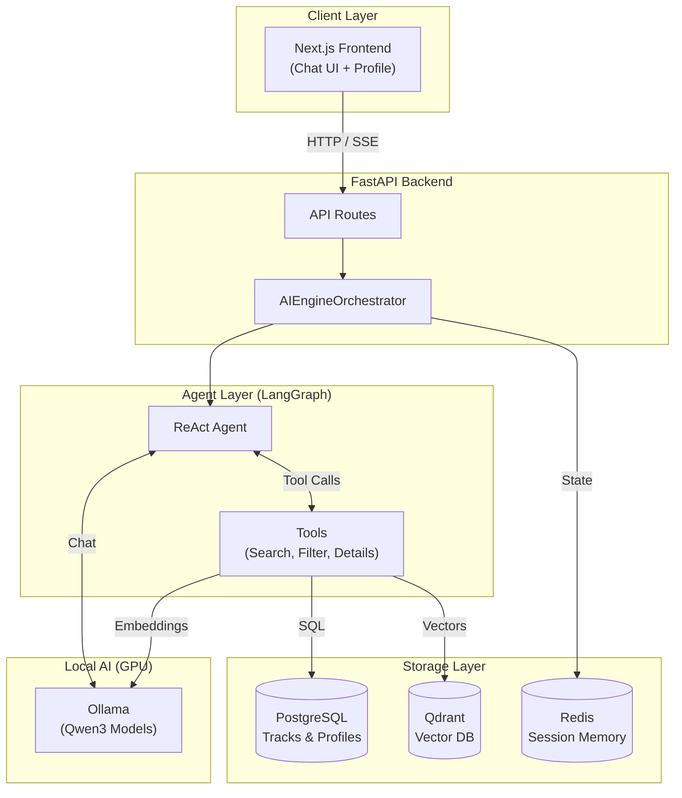

# AI SaaS Platform (Agentic RAG + LangGraph + Ollama)

Платформа персональных рекомендаций карьерно-образовательных треков для нефтегазовой отрасли, построенная на базе **Agentic RAG**. 

Система использует **LangGraph** для создания агента (React Agent), который может автономно выбирать инструменты, анализировать профиль пользователя, выполнять семантический поиск, жесткую фильтрацию и давать персонализированные рекомендации. 

Все вычисления (включая LLM и Embeddings) выполняются локально с **100% GPU-ускорением** через Ollama.

---

## 🏗 Архитектура



---

## 🚀 Быстрый старт

Требуется: **Docker Desktop** (рекомендуется включить WSL 2 для Windows), **docker compose**, **Python 3.10+**, **Node.js 18+**.

### 1) Запуск инфраструктуры
В корне репозитория поднимите базы данных и Ollama:
```bash
docker-compose up -d
```
*(Порты: Postgres - 5433, Redis - 6379, Qdrant - 6333, Ollama - 11434)*

### 2) Скачивание моделей (Qwen3)
Платформа настроена на работу с моделями **Qwen3**. Скачайте их в запущенный контейнер:
```bash
docker exec -it ai_saas_ollama ollama pull qwen3.5:4b
docker exec -it ai_saas_ollama ollama pull qwen3-embedding:0.6b
```
*Контейнер Ollama уже сконфигурирован на использование вашей видеокарты (GPU) через `deploy.resources` в `docker-compose.yml`.*

### 3) Настройка Backend
```bash
cd backend
python -m venv .venv
# Активация (Windows):
.venv\Scripts\activate
# Активация (Linux/macOS):
# source .venv/bin/activate

pip install -r requirements.txt
```

Создайте файл `backend/.env` со следующим содержимым:
```env
OLLAMA_BASE_URL=http://localhost:11434
OLLAMA_CHAT_MODEL=qwen3.5:4b
OLLAMA_EMBEDDING_MODEL=qwen3-embedding:0.6b

SECRET_KEY=CHANGE_ME_TO_SOMETHING_RANDOM
QDRANT_RECREATE_COLLECTIONS=true
```

### 4) Сидирование БД и индексация (Нефтегазовые треки)
Платформа поставляется с предзаполненными треками (Гидродинамическое моделирование, Геомеханика, Петрофизика и т.д.).
```bash
# В папке backend, с активированным venv:
python seed.py
python index_tracks.py
```

### 5) Запуск Backend
```bash
uvicorn app.main:app --reload --port 8000
```
Проверка работоспособности LLM: `http://localhost:8000/api/v1/chat/health`

### 6) Запуск Frontend
В новом терминале:
```bash
cd frontend
npm install
npm run dev
```
Откройте `http://localhost:3000`. 
*Перейдите на страницу **Агент** (`/chat`), чтобы начать тестирование.*

---

## 🛠 Особенности реализации Agentic RAG

1. **LangGraph ReAct Agent**: Агент не просто генерирует текст. Он получает инструкции (system prompt), анализирует профиль пользователя (навыки, формат работы) и решает, какой инструмент (Tool) вызвать.
2. **Инструменты (Tools)**:
   - `search_tracks`: Семантический поиск по Qdrant с использованием эмбеддингов Qwen.
   - `filter_tracks`: Строгая SQL-фильтрация по формату, региону или специализации.
   - `fetch_track_details`: Получение расширенной информации о конкретном треке.
3. **Объяснимость (Explainability)**: Агент сопоставляет навыки пользователя (`profile.skills`) с требованиями трека (`track.required_skills` - JSONB) и объясняет, почему трек подходит, а какие навыки стоит подтянуть.
4. **Контекстная память**: История диалогов и фильтры сохраняются в Redis (`RedisMemoryStore`), позволяя агенту вести stateful-беседу.

---

## ⚠️ Решение проблем

- **Ошибка "peer closed connection" или медленная генерация**: Убедитесь, что Docker использует GPU. Проверьте `docker exec -it ai_saas_ollama nvidia-smi`. Модели Qwen3.5:4b и Qwen3-Embedding:0.6b требуют около 4-5 ГБ VRAM.
- **Несовпадение размерности вектора Qdrant**: При смене embedding-модели в `.env` убедитесь, что установлен флаг `QDRANT_RECREATE_COLLECTIONS=true`, и заново запустите `python index_tracks.py`.
- **Ошибки атрибута skills**: Навыки хранятся в поле `required_skills` (формат JSONB: `{"Python": 0.5}`). Убедитесь, что используете правильное поле при обращении к модели `Track`.