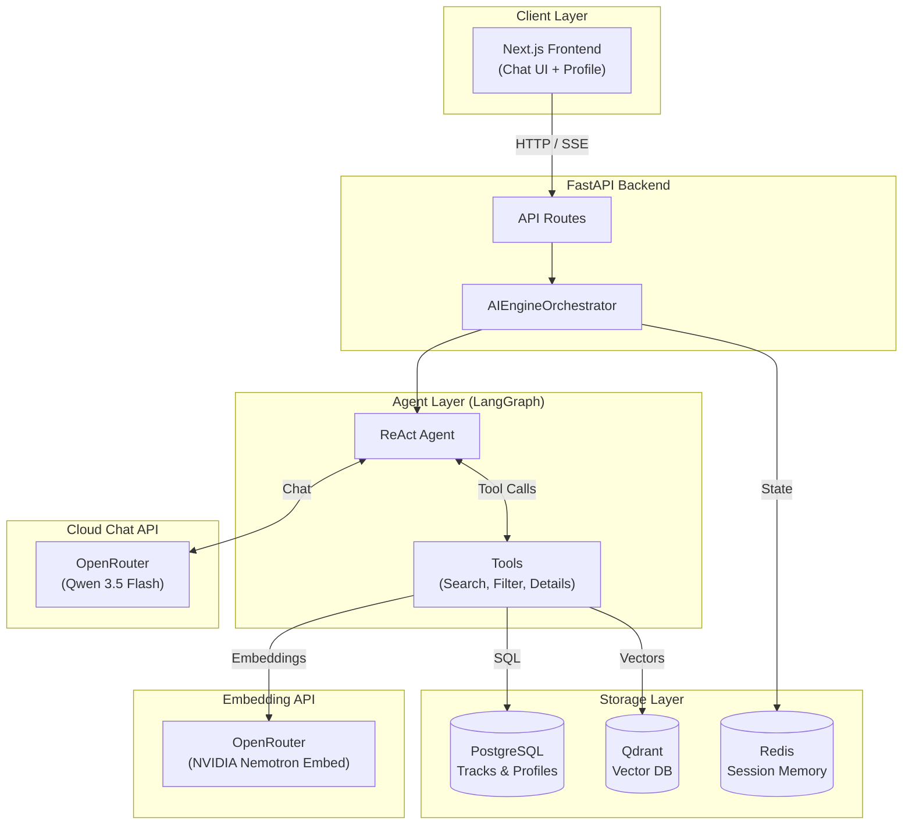

# AI SaaS Platform (Agentic RAG + LangGraph + OpenRouter)

Платформа персональных рекомендаций карьерно-образовательных треков для нефтегазовой отрасли, построенная на базе **Agentic RAG**. 

Система использует **LangGraph** для создания агента (React Agent), который может автономно выбирать инструменты, анализировать профиль пользователя, выполнять семантический поиск, жесткую фильтрацию и давать персонализированные рекомендации. 

И чатовая модель, и эмбеддинги для `Qdrant` работают через **OpenRouter**.

---

## 🏗 Архитектура



---

## 🚀 Быстрый старт

Требуется: **Docker Desktop** (рекомендуется включить WSL 2 для Windows), **docker compose**, **Python 3.10+**, **Node.js 18+**.

### 1) Запуск инфраструктуры
Сначала создайте локальные env-файлы из шаблонов:
```bash
copy .env.example .env
copy frontend\.env.example frontend\.env.local
```
Заполните секреты в `.env` и, при необходимости, demo-данные во `frontend/.env.local`.

### 2) Запуск инфраструктуры
В корне репозитория поднимите базы данных:
```bash
docker-compose up -d
```
*(Порты: Postgres - 5433, Redis - 6379, Qdrant - 6333)*

### 3) Настройка Backend
```bash
cd backend
python -m venv .venv
# Активация (Windows):
.venv\Scripts\activate
# Активация (Linux/macOS):
# source .venv/bin/activate

pip install -r requirements.txt
```
Backend и `docker-compose` используют общий корневой `.env`, поэтому секреты больше не хранятся в коде и yaml-файлах.

### 4) Настройка OpenRouter
Заполните в корневом `.env` как минимум:
```env
OPENROUTER_API_KEY=replace-with-your-openrouter-key
OPENROUTER_MODEL=qwen/qwen3.5-flash-02-23
OPENROUTER_EMBEDDING_MODEL=nvidia/llama-nemotron-embed-vl-1b-v2:free
SECRET_KEY=replace-with-a-long-random-secret
```
Если OpenRouter не возвращает размерность embedding-модели на старте, дополнительно задайте `EMBEDDING_DIMENSION`.

### 5) Сидирование БД и индексация (Нефтегазовые треки)
Платформа поставляется с предзаполненными треками (Гидродинамическое моделирование, Геомеханика, Петрофизика и т.д.).
```bash
# В папке backend, с активированным venv:
python seed.py
python index_tracks.py
```

### 6) Запуск Backend
```bash
uvicorn app.main:app --reload --port 8000
```
Проверка работоспособности OpenRouter для chat и embeddings: `http://localhost:8000/api/v1/chat/health`

### 7) Запуск Frontend
В новом терминале:
```bash
cd frontend
npm install
npm run dev
```
Откройте `http://localhost:3000`. 
*Перейдите на страницу **Агент** (`/chat`), чтобы начать тестирование.*

---

## 🛠 Особенности реализации Agentic RAG

1. **LangGraph ReAct Agent**: Агент не просто генерирует текст. Он получает инструкции (system prompt), анализирует профиль пользователя (навыки, формат работы) и решает, какой инструмент (Tool) вызвать.
2. **Инструменты (Tools)**:
   - `search_tracks`: Семантический поиск по Qdrant с использованием embedding API OpenRouter.
   - `filter_tracks`: Строгая SQL-фильтрация по формату, региону или специализации.
   - `fetch_track_details`: Получение расширенной информации о конкретном треке.
3. **Объяснимость (Explainability)**: Агент сопоставляет навыки пользователя (`profile.skills`) с требованиями трека (`track.required_skills` - JSONB) и объясняет, почему трек подходит, а какие навыки стоит подтянуть.
4. **Контекстная память**: История диалогов и фильтры сохраняются в Redis (`RedisMemoryStore`), позволяя агенту вести stateful-беседу.

---

## ⚠️ Решение проблем

- **Ошибка доступа к OpenRouter**: Проверьте `OPENROUTER_API_KEY`, `OPENROUTER_BASE_URL` и доступность модели `qwen/qwen3.5-flash-02-23` в вашем аккаунте.
- **Ошибка embedding API**: Проверьте `OPENROUTER_API_KEY`, `OPENROUTER_BASE_URL` и модель `nvidia/llama-nemotron-embed-vl-1b-v2:free`.
- **Несовпадение размерности вектора Qdrant**: При смене embedding-модели в `.env` убедитесь, что установлен флаг `QDRANT_RECREATE_COLLECTIONS=true`, и заново запустите `python index_tracks.py`. При необходимости явно задайте `EMBEDDING_DIMENSION`.
- **Ошибки атрибута skills**: Навыки хранятся в поле `required_skills` (формат JSONB: `{"Python": 0.5}`). Убедитесь, что используете правильное поле при обращении к модели `Track`.
