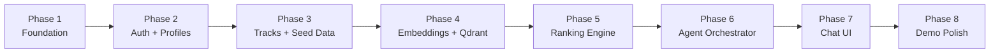
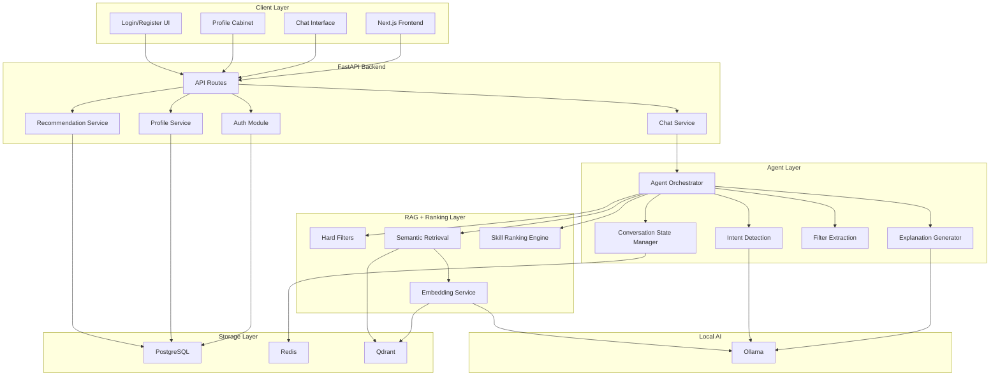

План процесса разработки демо - версии (MVP)
``

### Общая архитектура всего проекта


## 1. Общая концепция системы

Проект представляет собой AI-платформу рекомендаций карьерно-образовательных треков в формате диалогового assistant’а.

Пользователь взаимодействует с системой через чат-интерфейс. Ассистент анализирует профиль пользователя, задает уточняющие вопросы, применяет фильтры, выполняет semantic retrieval и ранжирование треков, после чего возвращает наиболее релевантные рекомендации с объяснением причин выбора.

Ключевая особенность проекта — реализация именно **agentic RAG architecture**, где LLM не принимает решения напрямую, а выступает как orchestration и explanation layer поверх deterministic recommendation pipeline.

# 2. Основная идея архитектуры

Система строится как набор независимых логических слоев:

```
Frontend
    ↓
API Layer
    ↓
Agent Orchestrator
    ↓
Retrieval + Ranking Engine
    ↓
Storage Layer
```

Каждый слой отвечает только за свою область ответственности.

# 3. Frontend Layer

Frontend реализуется как web-приложение на Next.js.

Основные задачи frontend:

- отображение chat UI;
- отображение рекомендаций;
- управление пользовательским профилем;
- авторизация;
- отображение состояния системы;
- взаимодействие с backend API.

## Основные страницы

### Login/Register

Страница авторизации пользователя.

После успешной авторизации frontend получает JWT token и использует его для дальнейших запросов.

### Chat Page

Главная страница платформы.

Содержит:

- историю сообщений;
- streaming ответы ассистента;
- recommendation cards;
- explanation blocks;
- quick filters.

Через эту страницу пользователь взаимодействует с agentic RAG системой.

### Profile Cabinet

Личный кабинет пользователя.

Позволяет:

- редактировать профиль;
- добавлять навыки;
- обновлять опыт;
- менять предпочтения;
- просматривать completeness score.

Изменения профиля напрямую влияют на retrieval и ranking.
### Tracks Page

Дополнительная страница просмотра треков.

Используется для:

- детального просмотра трека;
- отображения требований;
- объяснения совпадений.

# 4. Backend Layer

Backend реализуется на FastAPI.

Основная задача backend — orchestration всей системы.

# Backend разделяется на несколько модулей

## Auth Module

Отвечает за:

- регистрацию;
- логин;
- JWT;
- защиту endpoints.

После авторизации пользователь получает доступ к своему профилю и chat session.

---

## Profile Module

Отвечает за:

- CRUD профиля;
- проверку completeness;
- обновление embeddings;
- нормализацию profile data.

---

## Chat Module

Отвечает за:

- chat sessions;
- хранение conversation state;
- обработку пользовательских сообщений;
- routing запросов к orchestrator.

---

## Recommendation Module

Содержит deterministic recommendation engine:

- hard filters;
- semantic retrieval;
- ranking;
- scoring.

---

## Agent Module

Ядро всей системы.

Agent orchestrator управляет pipeline:

- анализирует intent;
- определяет следующий шаг;
- запускает retrieval;
- вызывает ranking;
- формирует explanation pipeline.

# 5. Agentic Architecture

Ключевая особенность проекта — наличие orchestration layer.

LLM не управляет системой напрямую.

# Agent работает как state machine

Основные состояния:

```
PROFILE_CHECK
CLARIFICATION
FILTER_EXTRACTION
RETRIEVALRANKING
EXPLANATION
FOLLOWUP
```

---

# Пример работы agent

## Пользователь пишет:

```
Подбери мне треки
```

---

## Agent:

1. Загружает профиль пользователя.
2. Проверяет обязательные поля.
3. Определяет missing fields.
4. При необходимости задает уточняющие вопросы.
5. Извлекает фильтры.
6. Запускает retrieval.
7. Запускает ranking.
8. Генерирует explanations.
9. Возвращает результат.

# 6. Recommendation Engine

Recommendation engine реализуется как deterministic pipeline.

Это критически важно для explainability и стабильности системы.

---

# Этап 1. Hard Filters

Сначала применяются жесткие ограничения.

Например:

- GPA ниже минимального;
- неподходящий курс;
- inactive track;
- неподходящий формат.

Все неподходящие треки исключаются ДО semantic search.

---

# Этап 2. Semantic Retrieval

После hard filtering выполняется semantic retrieval через embeddings.

---

## Embeddings используются для:

### Профиля

- about;
- specialty;
- experience;
- education;
- skills;
- portfolio.

---

### Треков

- title;
- description;
- required skills;
- tasks;
- specialization.

---

# Vector Search

Векторный поиск реализуется через Qdrant.

Qdrant хранит embeddings треков и позволяет выполнять similarity search.

---

# Этап 3. Skill Scoring

После retrieval выполняется skill-based ranking.

Система сравнивает:

- обязательные навыки;
- желательные навыки;
- дополнительные навыки пользователя.

---

# Пример

Если трек требует:

```
{  "python": 0.5,  "sql": 0.3,  "ml": 0.2}
```

то итоговый skill score рассчитывается как сумма совпавших skill weights.

---

# Этап 4. Final Ranking

Финальный score вычисляется как weighted combination:

```
final_score =semantic_similarity * 0.55 +skill_match * 0.35 +preference_match * 0.10
```

---

# 7. Explainability Layer

Объяснения являются отдельным компонентом системы.

Это важно для:

- доверия пользователя;
- прозрачности рекомендаций;
- demo value.

---

# Объяснение строится hybrid-способом

## Deterministic part

Система формирует:

- matched skills;
- matched preferences;
- semantic overlaps;
- GPA compatibility.

---

## LLM formatting

LLM преобразует structured explanation в естественный язык.

---

# Пример explanation

```
Этот трек рекомендован вам, потому что:- у вас есть Python и SQL;- ваш опыт backend-разработки совпадает с требованиями;- формат remote соответствует вашим предпочтениям;- ваш GPA выше минимального требования.
```

---

# 8. Conversation State

Система должна быть stateful.

Для этого используется Redis.

---

# Redis хранит:

- текущие фильтры;
- этап диалога;
- последние рекомендации;
- temporary memory;
- clarification state.

---

# Пример session state

```
{  "filters": {    "remote": true  },  "clarification_stage": 2,  "last_tracks": [],  "missing_fields": ["skills"]}
```

---

# 9. Profile System

Профиль пользователя является ядром personalization logic.

---

# Profile включает:

- skills;
- education;
- experience;
- preferences;
- location;
- employment format;
- portfolio.

---

# Completeness Score

Система рассчитывает completeness score профиля.

Это используется для:

- cold start flow;
- UX;
- prompting пользователя заполнить данные.

---

# После обновления профиля

Система:

1. сохраняет profile changes;
2. обновляет embeddings;
3. обновляет retrieval context.

---

# 10. Authentication System

Доступ к chat и recommendations возможен только после авторизации.

---

# Authentication реализуется через JWT

Flow:

```
login↓JWT token↓authenticated requests↓user-specific profile access
```

---

# Это позволяет:

- разделять пользователей;
- хранить personalized sessions;
- защищать profile data;
- сохранять chat history.

---

# 11. Database Layer

Основное хранилище — PostgreSQL.

---

# PostgreSQL хранит:

- users;
- profiles;
- tracks;
- recommendation logs;
- chat sessions metadata.

---

# Redis хранит:

- active chat state;
- temporary conversational memory.

---

# Qdrant хранит:

- embeddings;
- vector index.

---

# 12. Streaming Responses

Для улучшения UX используется streaming.

---

# Streaming нужен для:

- “живого” chat experience;
- ощущения AI assistant;
- demo quality.

---

# Реализация

FastAPI:

```
StreamingResponse
```

Frontend:

```
ReadableStream
```

---

# 13. Seed Data

Для MVP требуется качественный набор данных.

---

# Необходимо создать:

## 20–50 треков

С разными:

- специализациями;
- регионами;
- skill requirements;
- форматами работы.

---

# Также нужны:

## 5–10 demo profiles

С разными skill sets и preferences.

---

# 14. Development Strategy

Разработка должна идти поэтапно.

---

# Этап 1

Infrastructure setup:

- Docker;
- PostgreSQL;
- FastAPI;
- Next.js;
- auth skeleton.

---

# Этап 2

Profile system:

- profile CRUD;
- completeness;
- cabinet UI.

---

# Этап 3

Tracks system:

- tracks CRUD;
- seed data.

---

# Этап 4

Embeddings + Qdrant.

---

# Этап 5

Ranking engine.

---

# Этап 6

Agent orchestrator.

---

# Этап 7

Chat UI + streaming.

---

# Этап 8

Demo polish.

---

# 15. Основная инженерная идея проекта

Главная идея проекта заключается в разделении:

## deterministic logic

и

## LLM capabilities.

---

# Deterministic система отвечает за:

- retrieval;
- filtering;
- ranking;
- scoring.

---

# LLM отвечает за:

- conversational UX;
- explanations;
- clarification;
- natural dialogue.

---

# Это дает системе

- стабильность;
- explainability;
- предсказуемость;
- масштабируемость;
- production readiness.
