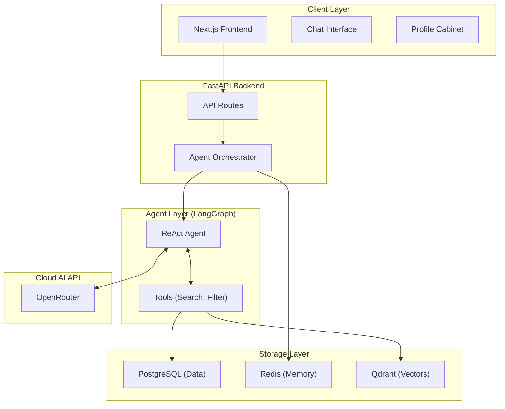

# Проект: AI-платформа карьерных рекомендаций (Нефтегазовая отрасль)

Платформа представляет собой интеллектуального ассистента на базе **Agentic RAG**, который помогает специалистам нефтегазовой отрасли (гидродинамика, геомеханика, петрофизика и др.) находить оптимальные образовательные и карьерные треки.

---

## 1. Основная концепция системы
Пользователь взаимодействует с системой через чат-интерфейс. Ассистент на базе **LangGraph ReAct Agent** анализирует профиль пользователя, задает уточняющие вопросы, применяет инструменты (поиск, фильтрация, детальный анализ треков) и возвращает релевантные рекомендации с объяснениями.

LLM не принимает решения в вакууме — она выступает как интеллектуальный слой оркестрации поверх детерминированной базы треков и векторного поиска.

---

## 2. Архитектура (Agentic RAG)

---

## 3. Ключевые компоненты

### Frontend Layer (Next.js)
- **Chat Page:** Основной интерфейс общения с AI-агентом. Поддержка SSE-стриминга.
- **Profile Cabinet:** Управление навыками, опытом и предпочтениями. Изменения профиля напрямую влияют на рекомендации агента.

### Backend Layer (FastAPI)
- **AIEngineOrchestrator:** Связующее звено между HTTP-запросами, памятью сессий (Redis) и агентом.
- **LangGraph Agent:** Интеллектуальное ядро, способное мыслить шагами (Thought -> Action -> Observation -> Response).

### Storage & AI Layer
- **PostgreSQL:** Хранение пользователей, профилей и каталога треков с JSONB-навыками.
- **Qdrant:** Векторная база для хранения эмбеддингов треков и быстрого семантического поиска.
- **Redis:** Хранение состояния сессии (Message history, Filters).
- **OpenRouter:** Выполнение chat-модели `qwen/qwen3.5-flash-02-23` и embedding-модели `nvidia/llama-nemotron-embed-vl-1b-v2:free` через единый API.

---

## 4. Как работает Agentic RAG

1. **User Input:** Пользователь пишет "Подбери мне трек по моделированию пласта".
2. **Context Assembly:** Оркестратор подтягивает историю диалога и данные профиля (навыки, локация) из БД.
3. **Agent Reasoning:** LLM решает, что нужно использовать инструмент `search_tracks`.
4. **Tool Execution:** Выполняется семантический поиск по Qdrant. Векторизуется запрос через embedding API OpenRouter.
5. **Observation:** Агент получает результаты поиска и анализирует их соответствие профилю пользователя.
6. **Final Response:** LLM формирует финальный ответ на русском языке, объясняя, почему конкретный трек подходит, и отдает теги для рендера карточек на клиенте.

---

## 5. Преимущества архитектуры
- **Гибкость интеграции:** Chat и embeddings доступны через единый OpenRouter API без локального ML-стека.
- **Производительность:** Автоматическое использование GPU (CUDA) для LLM и эмбеддингов.
- **Точность (Explainability):** LLM не галлюцинирует треки. Она работает только с теми данными, которые вернули Tools из базы данных.
- **Расширяемость:** Добавление новых возможностей (например, анализ резюме) сводится к добавлению нового Tool'а в LangGraph.
